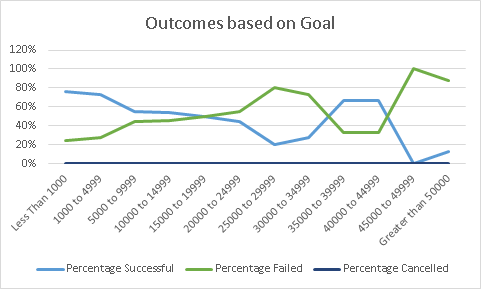

# An Analysis of Kickstarter Campaigns

An analysis that has information and images that will help understand what is needed to have a succesful Kickstarting campaign
using only Excel.

## Overview of Project

Based on the information i received throughout the module and the document of all the kickstarter data, i was able to filter specific information in order to show data in a manner where anybody can understand and see it. This data is based on Plays/theater kickstarter data mostly.

## Analysis of Outcomes Based on Launch Date

According to the chart above, we can conclude that the most successful campaings were kickstarted in the month of may while the ones with the least success runs were in the month december meaning that summer might be best time to start a kickstarter campaign. We can also see that through the months, campaings were cancelled but at a very minimal rate meaning that in general, campaign have a better success rate than being canceled.

## Analysis of Outcomes Based on Goals

Thanks to the analysis  of outcomes based on goals, i was able to find out that from the total number of all successful kickstarters campaigns(theaters/plays), the one with the most success(76% success rate) were campaigns that had a monetary goal of under 1000 dollars. In a close second, campaigns with a monetary goal between 1000 to 4999 dollars, had a success rate of an oustanding 73%. 
Furthermore, as campaign monetary goals were increasing, the success rate was decreasing steadaly.
### Challenges and Difficulties Encountered

I had issues mostly with the functions needed for the outcomes based on launch date. The functions were complicated to a point because of how big they were. I was able to difficulty by looking at one function and then doing it manually for every cell until i was able to get a grasp of it

## Results

- Limitation of the Dataset

This a data set of kickstarters from a while back, now this information may not be the same due to the fact of all the changes that have been happening around the world, things like Covid or trends in general. Furthermore, i believe the data set needed some information about the adverticement of the campaigns, im sure if there were some sort of data about the way the kickstarters were adverticed, then the success rate for theh curret kickstarter we are trying to launch would highly likely increase.

- What are some other possible tables and/or graphs that we could create?

We could also create a table or graph that would compare the amount of people pledged through all different types of kickstarters to have an idea how succesful plays and art is compared to others just in case there is an idea to have another campaign with a different goal in mind.                                        

